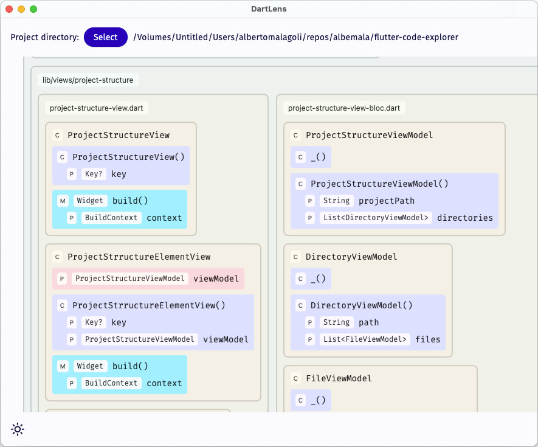
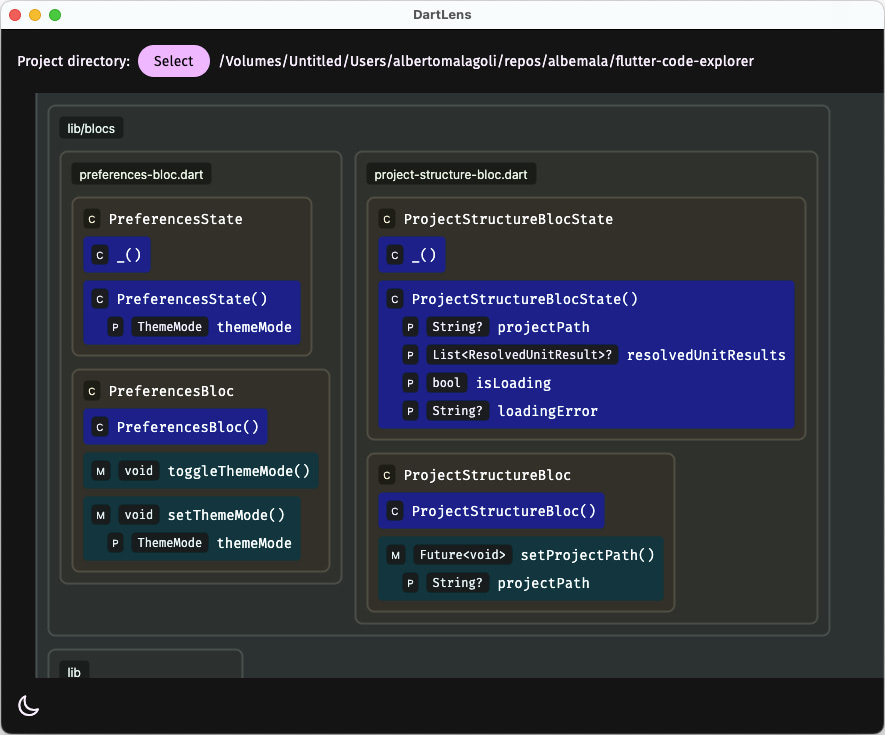
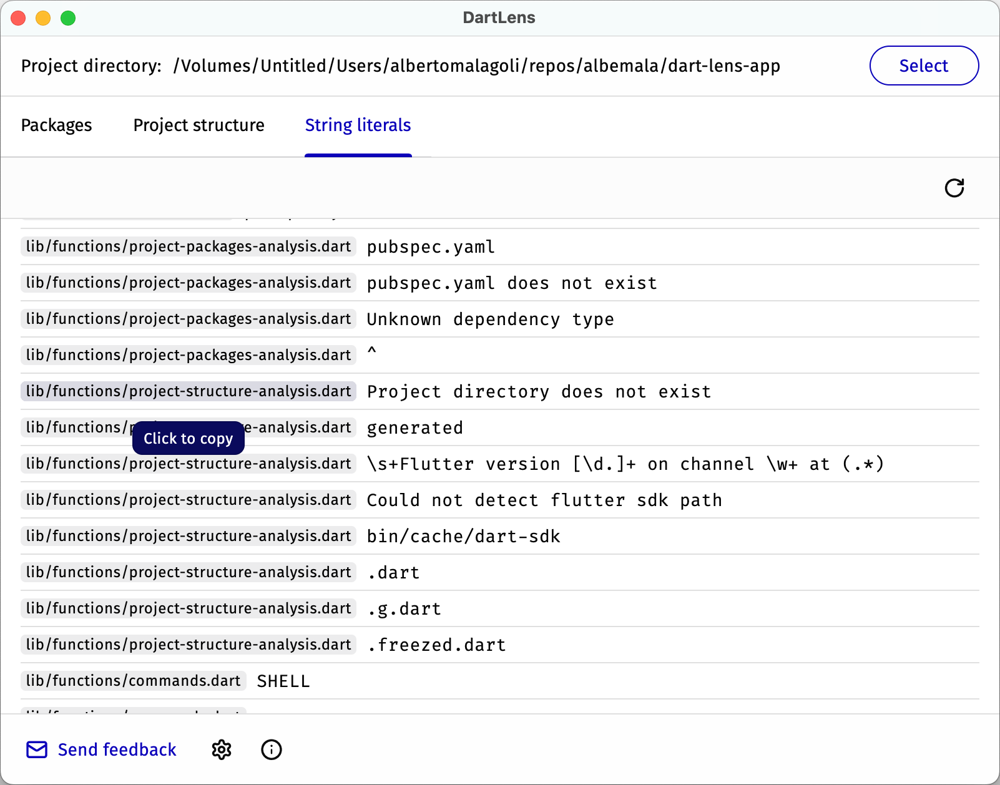

# DartLens

DartLens is an intuitive and powerful tool for exploring and managing your Dart and Flutter projects. With DartLens, you
can easily visualize the connections between elements, find potential issues, make changes to your code, upgrade
packages, and more. The app gives you an overview of all the files, classes, and declarations, providing a clear and
concise UML diagram of your project. Whether you're a seasoned developer or just starting with Dart and Flutter,
DartLens will help you navigate your projects with ease.

| macOS | Windows | Linux |
|:-----:|:-------:|:-----:|
|   ✅   |    ✅    |   ✅   |

## Features

### Package management

**What**: A detailed list of project dependencies, showcasing installable versions, the latest updates, changelogs, and
additional package information.

**Why**: Efficient package management is vital for maintaining a healthy codebase. By keeping packages up-to-date, it
helps in avoiding potential conflicts, deprecated methods, and security vulnerabilities. The inclusion of changelogs and
package info further assists in making informed decisions, ensuring that the chosen packages align well with the
project's requirements.

https://github.com/albemala/dart-lens-app/assets/2332860/2348ea9c-2227-4108-beec-c7d933bcf58f

### Project structure

**What**: A comprehensive visualization offering an overview of all the files, classes, and declarations
within your Dart and Flutter project.

**Why**: By presenting a clear layout of every file and class, developers can gain a deeper understanding of the
architecture and design.

https://user-images.githubusercontent.com/2332860/225592833-f351d00c-2582-4ee3-91ef-8795729a5c7c.mp4

### String literals

**What**: An exhaustive list of all the string values used throughout the project.

**Why**: Managing and locating strings becomes a cinch with this feature. For developers aiming to implement
internationalization (i18n) or just striving for consistency in messaging and labeling, having a consolidated view of
all string literals is invaluable. It simplifies the process of making content changes, aids in the detection of
hard-coded values that might be better served in a configuration or language file, and ensures that redundant or
repetitive strings can be spotted and managed with ease.

## How to run it

You can download the latest macOS
release [here](https://github.com/albemala/dart-lens-app/releases/latest/download/DartLens.app.zip),
or you can run the app from [source code](https://github.com/albemala/dart-lens-app/releases/latest/)
with `flutter run`.

## Development

DartLens is developed in Flutter. It works on all desktop operating systems (macOS, Windows, Linux).

**Note**: The app was developed and tested with **Flutter 3.10**.

Setup, how to run and build: https://docs.flutter.dev/desktop

## Support this project

## Other projects

🎨 **[Hexee Pro](https://hexee.app/)** — Palette editor & Advanced color toolkit

🧰 **[exabox](https://exabox.app/)** — Essential tools for developers: All the tools you need in one single app.

😃 **[Ejimo](https://github.com/albemala/emoji-picker)** — Emoji and symbol picker

🗺️ **[WMap](https://wmap.albemala.me/)** — Create beautiful, minimal, custom map wallpapers and backgrounds for your
phone or tablet.

🧩 **[iro‿iro](https://iro-iro.albemala.me/)** — Rearrange the colors to form beautiful patterns in this relaxing color
puzzle game.

## Credits

Created by [@albemala](https://github.com/albemala) ([Twitter](https://twitter.com/albemala))
